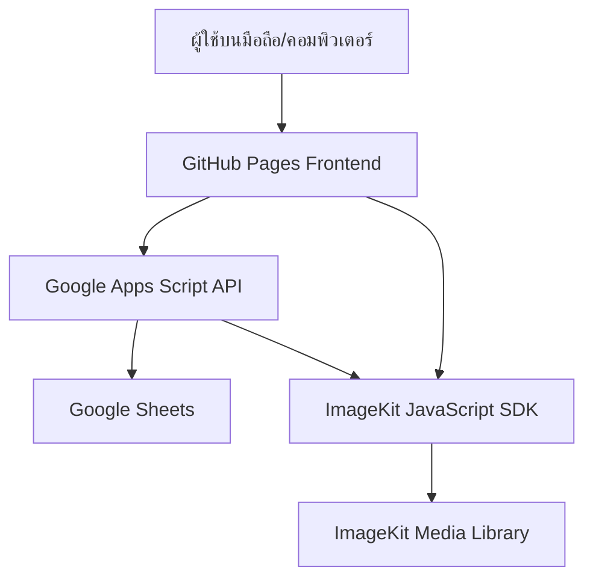
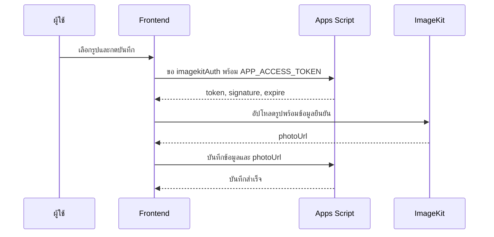

# Smart Farm Asset & Traceability System

เอกสารนี้อธิบายสถาปัตยกรรม การไหลของข้อมูล วิธีดูแลระบบ และแนวทางต่อยอด
ของ Smart Farm Asset & Traceability System เวอร์ชัน 1.0

## 1. เป้าหมายของระบบ

เว็บแอปนี้ช่วยจัดการข้อมูลสำคัญของฟาร์มจากโทรศัพท์หรือคอมพิวเตอร์:

- บันทึกรายจ่ายและรูปใบเสร็จ
- จัดทำทะเบียนสินทรัพย์และสถานะอุปกรณ์
- จัดทำทะเบียนสุกร/แม่พันธุ์และประวัติย่อ
- ค้นหา แก้ไข และนำรายการออกแบบ Soft Delete
- แสดงภาพรวมจำนวนรายการและยอดรายจ่าย

## 2. สถาปัตยกรรมปัจจุบัน



| ส่วนประกอบ | หน้าที่ |
|---|---|
| GitHub Pages | ให้บริการหน้าเว็บ, JavaScript และ PWA |
| Google Apps Script | ตรวจสิทธิ์ ตรวจข้อมูล สร้าง UUID และอ่าน/เขียนชีต |
| Google Sheets | ฐานข้อมูล Expenses, Assets และ Livestock |
| ImageKit | เก็บและแสดงรูปใบเสร็จ สินทรัพย์ และสุกร |
| Service Worker | เก็บ App Shell และช่วยรองรับ PWA |

## 3. โมดูลข้อมูล

### Expenses

เก็บรายจ่าย:

`id`, `timestamp`, `updatedAt`, `deletedAt`, `date`, `category`, `amount`,
`description`, `photoUrl`

### Assets

เก็บทะเบียนสินทรัพย์:

`id`, `timestamp`, `updatedAt`, `deletedAt`, `assetName`, `acquiredDate`,
`condition`, `note`, `photoUrl`

### Livestock

เก็บทะเบียนสุกร:

`id`, `timestamp`, `updatedAt`, `deletedAt`, `earTag`, `breed`, `history`,
`photoUrl`

ระบบป้องกันเบอร์หูซ้ำ และใช้ `deletedAt` เพื่อเก็บประวัติรายการที่นำออก
แทนการลบแถวจากชีตอย่างถาวร

## 4. กระบวนการเชื่อมต่อและสิทธิ์

1. ผู้ใช้เปิดหน้าเว็บจาก GitHub Pages
2. Frontend อ่าน `APP_ACCESS_TOKEN` จาก `localStorage` ของอุปกรณ์
3. Frontend เรียก `action=health` เพื่อตรวจ API และเวอร์ชัน
4. Frontend เรียกข้อมูลทั้งสามชีตพร้อม Token
5. Apps Script เปรียบเทียบ Token กับ `APP_ACCESS_TOKEN` ใน Script Properties
6. ถ้าตรงกัน ระบบจะแสดงข้อมูลและสถานะ “เชื่อมต่อแล้ว”

Token ไม่ถูกบันทึกใน GitHub และต้องกรอกใหม่เมื่อเปลี่ยนอุปกรณ์ ล้างข้อมูล
เบราว์เซอร์ หรือเปลี่ยนค่า `APP_ACCESS_TOKEN`

สถานะมุมขวาบน:

| สถานะ | ความหมาย |
|---|---|
| กำลังเชื่อมต่อ | กำลังตรวจ API หรือโหลดข้อมูล |
| เชื่อมต่อแล้ว | คำขอล่าสุดสำเร็จ |
| Token ไม่ถูกต้อง | Token ในอุปกรณ์ไม่ตรงกับ Script Properties |
| เชื่อมต่อไม่ได้ | เครือข่าย, timeout หรือ HTTP ล้มเหลว |
| ระบบขัดข้องบางส่วน | API เข้าถึงได้ แต่บางฟังก์ชันผิดพลาด |

Frontend ใช้เลขรุ่นของการโหลดเพื่อป้องกันคำขอเก่าที่ตอบกลับช้ากว่า
มาเขียนทับสถานะของคำขอใหม่

## 5. กระบวนการอัปโหลดรูป



`IMAGEKIT_PRIVATE_KEY` อยู่ใน Apps Script Script Properties เท่านั้น ส่วน
Public Key และ URL Endpoint อยู่ใน Frontend การอัปโหลดใช้ ImageKit
JavaScript SDK v4 ซึ่งต้องส่ง `token`, `signature` และ `expire` ในแต่ละครั้ง

## 6. API ปัจจุบัน

| Method | Action | หน้าที่ |
|---|---|---|
| GET | `health` | ตรวจเวอร์ชัน จำนวนข้อมูล โหมด Token และ ImageKit |
| GET | `list` | อ่านรายการจากชีต |
| GET | `imagekitAuth` | สร้างข้อมูลยืนยันอัปโหลดแบบหมดอายุ |
| POST | `create` | สร้างรายการ |
| POST | `update` | แก้ไขรายการด้วย UUID |
| POST | `delete` | Soft Delete |
| POST | `restore` | กู้คืนรายการ |

ทุก Action ยกเว้น `health` ต้องผ่าน `APP_ACCESS_TOKEN`

## 7. Validation และความปลอดภัย

- Private Key ไม่อยู่ใน Frontend หรือ GitHub
- ตรวจ Token ฝั่ง Apps Script ก่อนอ่าน/เขียน
- จำกัดชื่อชีตและฟิลด์ที่อนุญาต
- ตรวจวันที่ จำนวนเงิน และข้อมูลบังคับ
- ป้องกันเบอร์หูซ้ำ
- Escape HTML ก่อนแสดงข้อมูล
- รับ URL รูปแบบ HTTPS เท่านั้น
- จำกัดไฟล์รูปไม่เกิน 8 MB
- ใช้ LockService ป้องกันการเขียนชนกัน
- ใช้ Soft Delete เพื่อรักษาประวัติ

## 8. Deployment และการดูแล

### Frontend

- Repository: `aodxx/Smart-Farm-Asset-Traceability-System`
- Production branch: `main`
- Hosting: GitHub Pages จากโฟลเดอร์ root
- เมื่อแก้ JavaScript สำคัญ ต้องเพิ่มรุ่น `CACHE_NAME` ใน `sw.js`

### Backend

- วาง `Code.gs` ใน Google Apps Script
- Script Properties:
  - `IMAGEKIT_PRIVATE_KEY`
  - `APP_ACCESS_TOKEN`
  - `SPREADSHEET_ID` เฉพาะ Standalone Script
- หลังแก้ `Code.gs` ต้องสร้าง Web App deployment version ใหม่
- ตั้ง Time zone ของ Apps Script และ Google Sheets เป็น `Asia/Bangkok`

### Health check

```text
WEB_APP_URL?action=health
```

ผลปกติต้องมี `status: success`, `version: 1.0.0`,
`secureMode: true` และ `imageUploadConfigured: true`

## 9. ข้อจำกัดปัจจุบัน

- ใช้ Token ร่วม ยังไม่มีบัญชีผู้ใช้รายบุคคล
- Google Sheets เหมาะกับข้อมูลขนาดเล็กถึงปานกลาง
- ประวัติสุขภาพ วัคซีน และผสมพันธุ์ยังเป็นข้อความย่อ
- ยังไม่มีไฟล์แนบหลายรูปต่อหนึ่งรายการ
- ยังไม่มีระบบแจ้งเตือน งานตามกำหนด หรืออนุมัติ
- Dashboard ยังไม่มีกราฟเชิงเวลาและรายงานส่งออก

## 10. Roadmap การต่อยอด

### Phase 1 — ทำ v1 ให้เสถียร

- ทดสอบ Create/Update/Delete/Restore ครบทั้งสามโมดูล
- ทดสอบรูปจากกล้องโทรศัพท์และไฟล์หลายขนาด
- เพิ่มหน้าวินิจฉัยระบบสำหรับ Admin
- เพิ่มบันทึกข้อผิดพลาดแบบไม่เก็บข้อมูลลับ
- เพิ่มชุดทดสอบ API และ Frontend integration

### Phase 2 — งานฟาร์มเชิงลึก

- ประวัติซ่อมบำรุงและค่าใช้จ่ายต่อสินทรัพย์
- ตารางวัคซีน การรักษา และการแจ้งเตือน
- ประวัติผสมพันธุ์ ตั้งท้อง คลอด และลูกสุกร
- เชื่อมรายจ่ายกับสินทรัพย์หรือสุกร
- รองรับหลายรูปและเอกสารแนบ

### Phase 3 — ผู้ใช้และการควบคุม

- บัญชี Admin, Manager และ Staff
- Session แบบมีวันหมดอายุแทน Token ร่วม
- สิทธิ์รายหน้าจอและ Audit Log
- อนุมัติรายการสำคัญและบันทึกผู้แก้ไข
- Rate limiting และการหมุนเวียนคีย์

### Phase 4 — รายงานและอัตโนมัติ

- กราฟรายจ่ายรายเดือน/ปีและแนวโน้มต้นทุน
- รายงานสินทรัพย์ที่ต้องซ่อม
- ปฏิทินวัคซีน ผสมพันธุ์ และคลอด
- ส่งออก PDF และ CSV
- แจ้งเตือนผ่าน LINE Messaging API
- สำรองข้อมูลและรายงานสุขภาพระบบตามเวลา

### Phase 5 — ขยายฐานข้อมูล

เมื่อข้อมูล ผู้ใช้ หรือความสัมพันธ์ซับซ้อนขึ้น ให้พิจารณาย้ายจาก Google Sheets
ไป PostgreSQL/Supabase โดยคง Frontend และ ImageKit แล้วเพิ่ม:

- Row Level Security
- Auth รายบุคคล
- ตารางเชิงสัมพันธ์
- Realtime dashboard
- Edge Functions และ scheduled jobs

## 11. Workflow การพัฒนา

1. สร้าง Branch จาก `main`
2. แก้เฉพาะขอบเขตงานและอัปเดต `PROGRESS.md`
3. รัน `npm run check`, `npm test` และ `git diff --check`
4. เปิด Draft Pull Request
5. ตรวจ diff และผลกระทบ
6. Merge หลังได้รับคำยืนยัน
7. ตรวจ GitHub Pages หรือ Apps Script deployment จริง
8. บันทึกผลทดสอบและสิ่งที่ยังไม่ได้ตรวจ
